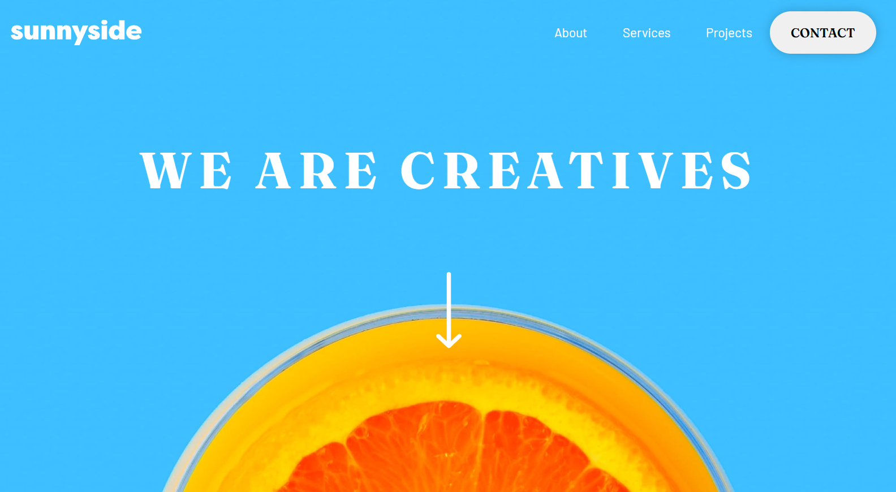

# Agency Landing Page

🌐 **Diseño responsive de una landing page** basado en el reto de [Frontend Mentor](https://www.frontendmentor.io).  
Desarrollado como práctica para mejorar habilidades en diseño y desarrollo web.

## 📝 Detalles del reto
- **Reto:** [Agency Landing Page](https://www.frontendmentor.io/challenges/agency-landing-page-7yVs3B6ef)  
- **Dificultad:** Junior  

## 🚀 Demo en vivo
Puedes ver el resultado final en el siguiente enlace:  
[Agency Landing Page - GitHub Pages](https://fbarrerac.github.io/fm-agency-landing-page/)

## 🛠 Tecnologías utilizadas
- **HTML**: Estructura del contenido.
- **CSS**: Estilos visuales, diseño responsive.
- **JavaScript**: Funcionalidad adicional.

## 📸 Captura del diseño

## 🚧 Estado del proyecto
El proyecto está tecnicamente **completo** pero con pequeños errores en el diseño reponsive.

## 🧑‍💻 Autor
Creado por [fbarrerac](https://github.com/fbarrerac).  
